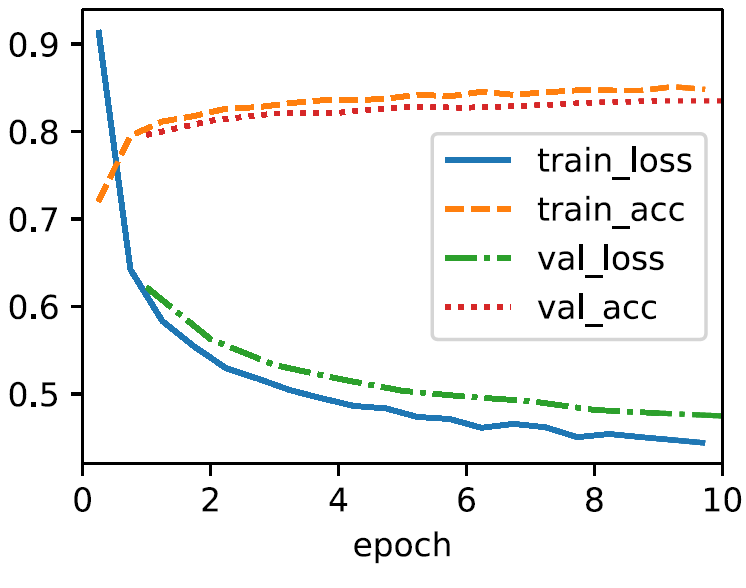
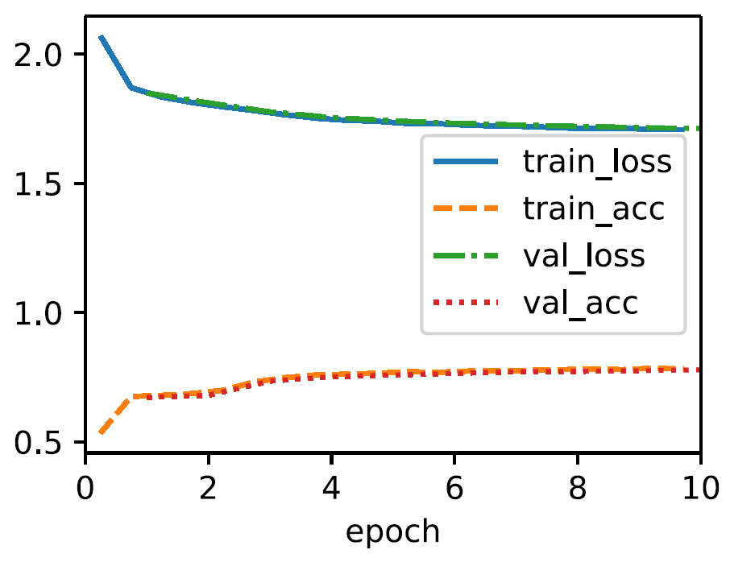
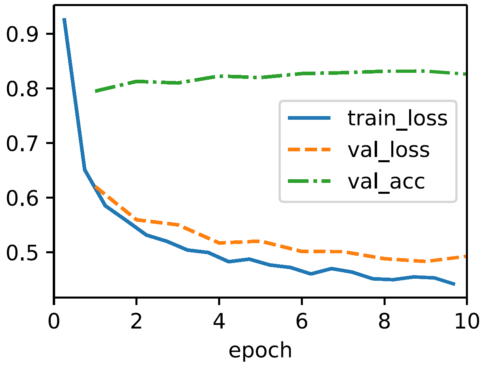

## HW1-DL

> 姓名：王子轩
>
> 学号：2023011307
>
> 邮箱：`wang-zx23@mails.tsinghua.edu.cn`

[TOC]

### **1**

> Code analysis

#### 1.1 Error analysis

关键在于正确分析`d2l`中默认的`trainer`函数的方法：在`L4_wrong.ipynb`给出的代码实现中`SoftmaxRegressionScratch` 类继承自 `Classifier` ，且没有显式定义 loss 方法，模型会使用父类的默认损失函数实现，可以通过如下代码运行得到:

```python
import inspect
print(inspect.getsource(d2l.Classifier.loss))
# output:
def loss(self, Y_hat, Y, averaged=True):
    Y_hat = d2l.reshape(Y_hat, (-1, Y_hat.shape[-1]))
    Y = d2l.reshape(Y, (-1,))
    return F.cross_entropy(Y_hat, Y, reduction='mean' if averaged else 'none')
```

可以看到父类的损失函数期望的是原始的 logits（即未经过 softmax 处理的值）, 因为 F.cross_entropy 内部会自动应用softmax.而由于我们 forward 方法输出的是经过自定义 softmax 函数处理的概率值

```python
def forward(self, X):
    X = X.reshape((-1, self.W.shape[0]))
    return self.softmax(torch.matmul(X, self.W) + self.b)
```

这会导致对已经通过 softmax 转为参数化概率的值再次应用 softmax ，softmax 函数是有饱和区的，双重 softmax 会影响梯度传播，因此训练效果不佳，我们发现训练损失曲线很快无法下降. 正常的softmax回归过程是依次进行：线性变换：$o = Wx + b$ (logits)，softmax 函数：$p_i = \frac{e^{o_i}}{\sum_j e^{o_j}}$， 交叉熵损失：$L = -\sum_i y_i \log(p_i)$. 按照源代码就变成$q_i = \frac{e^{p_i}}{\sum_j e^{p_j}}$, 最终损失：$L = -\sum_i y_i \log(q_i)$. 

#### 1.2 Experiments and results

我们做实验来证明我们的说法：在如下的代码中，我们先使用正确的交叉熵损失函数，可以得到合理的训练结果；再将正确的实现注释掉，手动实现双重 softmax 层，得到训练结果如图所示

```python
import torch
import torchvision
from torchvision import transforms
from torch.utils.data import Dataset, DataLoader
from d2l import torch as d2l
class FashionMNIST(d2l.DataModule):
    def __init__(self, batch_size=64, resize=(28, 28)):
        super().__init__()
        self.save_hyperparameters()
        trans = transforms.Compose([transforms.Resize(resize), transforms.ToTensor()])
        self.train = torchvision.datasets.FashionMNIST(
            root=self.root, train=True, transform=trans, download=True)
        self.val = torchvision.datasets.FashionMNIST(
            root=self.root, train=False, transform=trans, download=True)
    def text_labels(self, indices):
        labels = ['t-shirt', 'trouser', 'pullover', 'dress', 'coat',
                 'sandal', 'shirt', 'sneaker', 'bag', 'ankle boot']
        return [labels[int(i)] for i in indices]
    def get_dataloader(self, train):
        data = self.train if train else self.val
        return torch.utils.data.DataLoader(data, self.batch_size, shuffle=train)
    def train_dataloader(self):
        return self.get_dataloader(train=True)
    def val_dataloader(self):
        return self.get_dataloader(train=False)
    
class Classifier(d2l.Module):  #@save
    def validation_step(self, batch):
        Y_hat = self(*batch[:-1])
        self.plot('loss', self.loss(Y_hat, batch[-1]), train=False)
        self.plot('acc', self.accuracy(Y_hat, batch[-1]), train=False)
        
    def configure_optimizers(self):
        return torch.optim.SGD(self.parameters(), lr=self.lr)
    
    def accuracy(self, Y_hat, Y, averaged=True):
        Y_hat = Y_hat.reshape((-1, Y_hat.shape[-1]))
        preds = Y_hat.argmax(axis=1).type(Y.dtype)
        compare = (preds == Y.reshape(-1)).type(torch.float32)
        return compare.mean() if averaged else compare


class SoftmaxRegressionScratch(d2l.Classifier):
    def __init__(self, num_inputs, num_outputs, lr, sigma=0.01):
        super().__init__()
        self.save_hyperparameters()
        self.W = torch.normal(0, sigma, size=(num_inputs, num_outputs), requires_grad=True)
        self.b = torch.zeros(num_outputs, requires_grad=True)
    # 正确实现方式
    # def loss(self, Y_hat, Y):  
    #     return cross_entropy(Y_hat, Y)
    # 模拟错误情形
    def loss(self, Y_hat, Y):
        second_softmax = self.softmax(Y_hat)
        return -torch.log(second_softmax[range(len(Y_hat)), Y]).mean()
    def training_step(self, batch): 
        l = self.loss(self(*batch[:-1]), batch[-1])
        self.plot('loss', l, train=True)
        self.plot('acc', self.accuracy(self(*batch[:-1]), batch[-1]), train=True)
        return l
    def parameters(self):
        return [self.W, self.b]    
    def forward(self, X):
        X = X.reshape((-1, self.W.shape[0]))
        return self.softmax(torch.matmul(X, self.W) + self.b)   
    def softmax(self, X):
        X_exp = torch.exp(X)
        partition = X_exp.sum(1, keepdims=True)
        return X_exp / partition
```

Results

| 正确实现训练                                                 | 模拟错误情形                                                 | 改正源码后                                                   |
| ------------------------------------------------------------ | ------------------------------------------------------------ | ------------------------------------------------------------ |
|  |  |  |

#### 1.3 Source code corrections

在源代码训练前，在 model 中加入如下自定义 loss 损失函数，得到结果如上图第三张结果所示，详细代码可见文件夹中的`L4_contrary.ipynb`

```python
@d2l.add_to_class(d2l.Classifier)  #@save
def loss(self, Y_hat, Y, averaged=True):
    Y_hat = Y_hat.reshape((-1, Y_hat.shape[-1]))
    Y = Y.reshape((-1,))
    return F.cross_entropy(
        Y_hat, Y, reduction='mean' if averaged else 'none')
```

### **2**

> Image Classification


