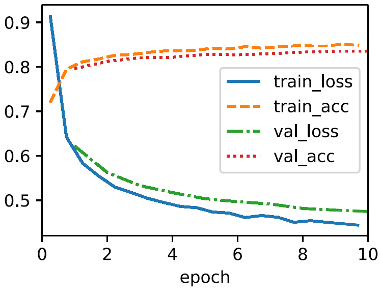
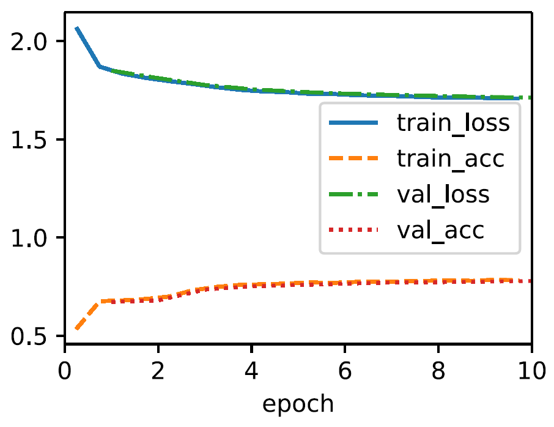
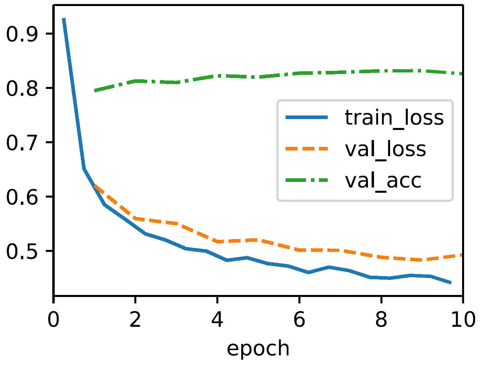
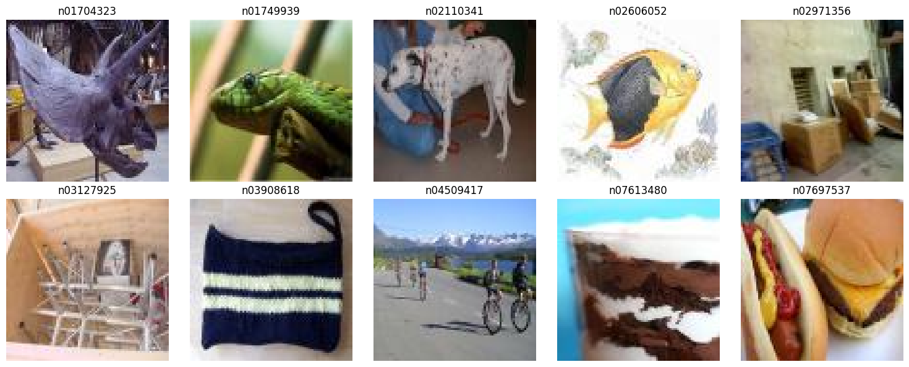
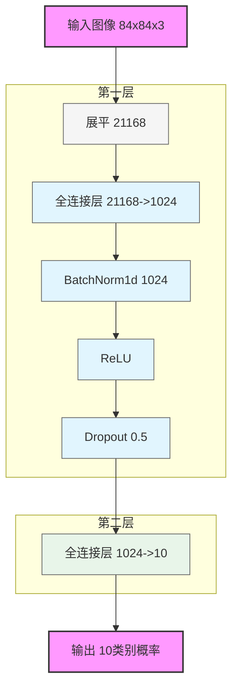
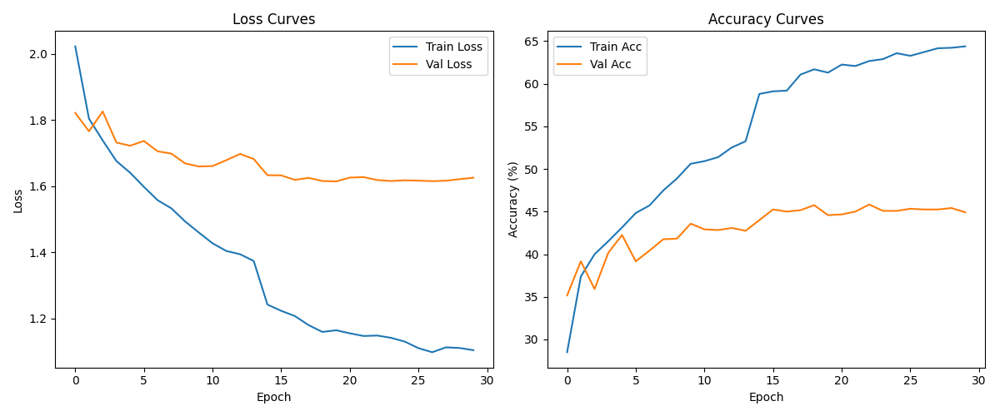
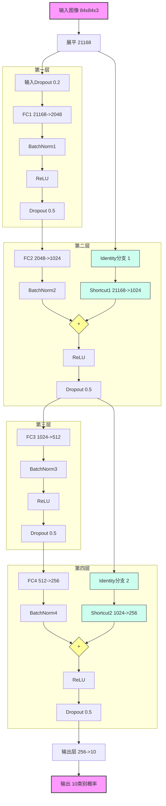
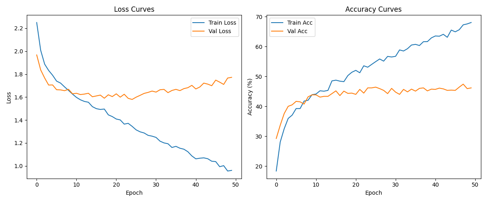
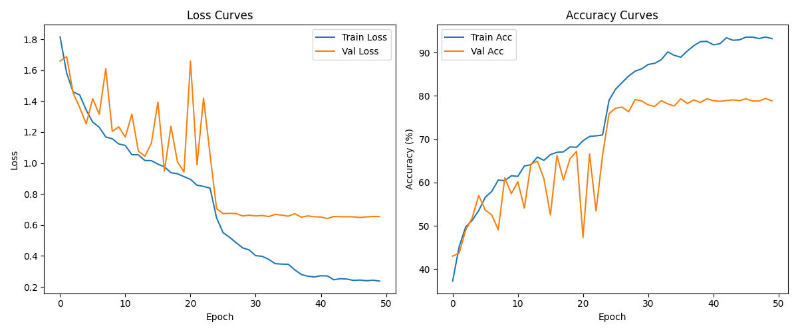

## HW1-DL

> 姓名：王子轩
>
> 学号：2023011307
>
> 邮箱：`wang-zx23@mails.tsinghua.edu.cn`

[TOC]

### **1**

> Code analysis

#### 1.1 Error analysis

关键在于正确分析`d2l`中默认的`trainer`函数的方法：在`L4_wrong.ipynb`给出的代码实现中`SoftmaxRegressionScratch` 类继承自 `Classifier` ，且没有显式定义 loss 方法，模型会使用父类的默认损失函数实现，可以通过如下代码运行得到:

```python
import inspect
print(inspect.getsource(d2l.Classifier.loss))
# output:
def loss(self, Y_hat, Y, averaged=True):
    Y_hat = d2l.reshape(Y_hat, (-1, Y_hat.shape[-1]))
    Y = d2l.reshape(Y, (-1,))
    return F.cross_entropy(Y_hat, Y, reduction='mean' if averaged else 'none')
```

可以看到父类的损失函数期望的是原始的 logits（即未经过 softmax 处理的值）, 因为 F.cross_entropy 内部会自动应用softmax.而由于我们 forward 方法输出的是经过自定义 softmax 函数处理的概率值

```python
def forward(self, X):
    X = X.reshape((-1, self.W.shape[0]))
    return self.softmax(torch.matmul(X, self.W) + self.b)
```

这会导致对已经通过 softmax 转为参数化概率的值再次应用 softmax ，softmax 函数是有饱和区的，双重 softmax 会影响梯度传播，因此训练效果不佳，我们发现训练损失曲线很快无法下降. 正常的softmax回归过程是依次进行：线性变换：$o = Wx + b$ (logits)，softmax 函数：$p_i = \frac{e^{o_i}}{\sum_j e^{o_j}}$， 交叉熵损失：$L = -\sum_i y_i \log(p_i)$. 按照源代码就变成$q_i = \frac{e^{p_i}}{\sum_j e^{p_j}}$, 最终损失：$L = -\sum_i y_i \log(q_i)$. 

#### 1.2 Experiments and results

我们做实验来证明我们的说法：在如下的代码中，我们先使用正确的交叉熵损失函数，可以得到合理的训练结果；再将正确的实现注释掉，手动实现双重 softmax 层，得到训练结果如图所示

```python
import torch
import torchvision
from torchvision import transforms
from torch.utils.data import Dataset, DataLoader
from d2l import torch as d2l
class FashionMNIST(d2l.DataModule):
    def __init__(self, batch_size=64, resize=(28, 28)):
        super().__init__()
        self.save_hyperparameters()
        trans = transforms.Compose([transforms.Resize(resize), transforms.ToTensor()])
        self.train = torchvision.datasets.FashionMNIST(
            root=self.root, train=True, transform=trans, download=True)
        self.val = torchvision.datasets.FashionMNIST(
            root=self.root, train=False, transform=trans, download=True)
    def text_labels(self, indices):
        labels = ['t-shirt', 'trouser', 'pullover', 'dress', 'coat',
                 'sandal', 'shirt', 'sneaker', 'bag', 'ankle boot']
        return [labels[int(i)] for i in indices]
    def get_dataloader(self, train):
        data = self.train if train else self.val
        return torch.utils.data.DataLoader(data, self.batch_size, shuffle=train)
    def train_dataloader(self):
        return self.get_dataloader(train=True)
    def val_dataloader(self):
        return self.get_dataloader(train=False)
    
class Classifier(d2l.Module):  #@save
    def validation_step(self, batch):
        Y_hat = self(*batch[:-1])
        self.plot('loss', self.loss(Y_hat, batch[-1]), train=False)
        self.plot('acc', self.accuracy(Y_hat, batch[-1]), train=False)
        
    def configure_optimizers(self):
        return torch.optim.SGD(self.parameters(), lr=self.lr)
    
    def accuracy(self, Y_hat, Y, averaged=True):
        Y_hat = Y_hat.reshape((-1, Y_hat.shape[-1]))
        preds = Y_hat.argmax(axis=1).type(Y.dtype)
        compare = (preds == Y.reshape(-1)).type(torch.float32)
        return compare.mean() if averaged else compare


class SoftmaxRegressionScratch(d2l.Classifier):
    def __init__(self, num_inputs, num_outputs, lr, sigma=0.01):
        super().__init__()
        self.save_hyperparameters()
        self.W = torch.normal(0, sigma, size=(num_inputs, num_outputs), requires_grad=True)
        self.b = torch.zeros(num_outputs, requires_grad=True)
    # 正确实现方式
    # def loss(self, Y_hat, Y):  
    #     return cross_entropy(Y_hat, Y)
    # 模拟错误情形
    def loss(self, Y_hat, Y):
        second_softmax = self.softmax(Y_hat)
        return -torch.log(second_softmax[range(len(Y_hat)), Y]).mean()
    def training_step(self, batch): 
        l = self.loss(self(*batch[:-1]), batch[-1])
        self.plot('loss', l, train=True)
        self.plot('acc', self.accuracy(self(*batch[:-1]), batch[-1]), train=True)
        return l
    def parameters(self):
        return [self.W, self.b]    
    def forward(self, X):
        X = X.reshape((-1, self.W.shape[0]))
        return self.softmax(torch.matmul(X, self.W) + self.b)   
    def softmax(self, X):
        X_exp = torch.exp(X)
        partition = X_exp.sum(1, keepdims=True)
        return X_exp / partition
```

Results

| 正确实现训练                                                 | 模拟错误情形                                                 | 改正源码后                                                   |
| ------------------------------------------------------------ | ------------------------------------------------------------ | ------------------------------------------------------------ |
|  |  |  |

#### 1.3 Source code corrections

在源代码训练前，在 model 中加入如下自定义 loss 损失函数，得到结果如上图第三张结果所示，详细代码可见文件夹中的`L4_contrary.ipynb`

```python
@d2l.add_to_class(d2l.Classifier)  #@save
def loss(self, Y_hat, Y, averaged=True):
    Y_hat = Y_hat.reshape((-1, Y_hat.shape[-1]))
    Y = Y.reshape((-1,))
    return F.cross_entropy(
        Y_hat, Y, reduction='mean' if averaged else 'none')
```

### **2**

> Image Classification: Data of 10 categories of image classification from the ImageNet dataset and load 10 categories used for this assignments. 分别使用如下三种模型进行pre-train
- Simple 2-layer NN
- MLP
- CNN 

注：实验代码实现细节在文件夹中的`main.ipynb`文件中，这里仅仅提供设计思路和实验结果分析。

#### 2.1 Data Preparation

依照作业要求，选择了ImageNet数据集的一个子集合，共10种类别，每种类别的图片共600张，划分为3:1:1的训练、验证和测试集。选择理由也在`main.ipynb`文件中有详细的说明。



#### 2.2 Model & Training

##### Simple 2-layer NN

模型定义、训练、评估参数均实现在了文件`layer2NN.py`中。






##### MLP (with Res)

模型定义、训练、评估参数均实现在了文件`mlp.py`中。






##### CNN

模型定义、训练、评估参数均实现在了文件`cnn.py`中。

```mermaid
graph TD
    Input[输入图像 84x84x3] --> Conv1[Conv1 84x84x64]
    Conv1 --> BN1[BatchNorm1]
    BN1 --> ReLU1[ReLU]
    ReLU1 --> Conv2[Conv2 84x84x64]
    Conv2 --> BN2[BatchNorm2]
    BN2 --> ReLU2[ReLU]
    ReLU2 --> Pool1[MaxPool1 42x42x64]
    Pool1 --> Drop1[Dropout1]

    Drop1 --> Conv3[Conv3 42x42x128]
    Conv3 --> BN3[BatchNorm3]
    BN3 --> ReLU3[ReLU]
    ReLU3 --> Conv4[Conv4 42x42x128]
    Conv4 --> BN4[BatchNorm4]
    BN4 --> ReLU4[ReLU]
    ReLU4 --> Pool2[MaxPool2 21x21x128]
    Pool2 --> Drop2[Dropout2]

    Drop2 --> Conv5[Conv5 21x21x256]
    Conv5 --> BN5[BatchNorm5]
    BN5 --> ReLU5[ReLU]
    ReLU5 --> Conv6[Conv6 21x21x256]
    Conv6 --> BN6[BatchNorm6]
    BN6 --> ReLU6[ReLU]
    ReLU6 --> Pool3[MaxPool3 10x10x256]
    Pool3 --> Drop3[Dropout3]

    Drop3 --> Flatten[Flatten 25600]
    Flatten --> FC1[FC1 512]
    FC1 --> BN7[BatchNorm7]
    BN7 --> ReLU7[ReLU]
    ReLU7 --> Drop4[Dropout4]
    Drop4 --> FC2[FC2 10]
    FC2 --> Output[输出 10类别概率]

    style Input fill:#f9f,stroke:#333,stroke-width:2px
    style Output fill:#f9f,stroke:#333,stroke-width:2px
    
    subgraph 第一个卷积块
        Conv1
        BN1
        ReLU1
        Conv2
        BN2
        ReLU2
        Pool1
        Drop1
    end
    
    subgraph 第二个卷积块
        Conv3
        BN3
        ReLU3
        Conv4
        BN4
        ReLU4
        Pool2
        Drop2
    end
    
    subgraph 第三个卷积块
        Conv5
        BN5
        ReLU5
        Conv6
        BN6
        ReLU6
        Pool3
        Drop3
    end
    
    subgraph 全连接层
        Flatten
        FC1
        BN7
        ReLU7
        Drop4
        FC2
    end
```






#### 2.3 Results

|                      | **2-layer NN**                                               | **MLP**                                                      | **CNN**                                                      |
| -------------------- | ------------------------------------------------------------ | ------------------------------------------------------------ | ------------------------------------------------------------ |
| **Epochs**           | 30                                                           | 50                                                           | 50                                                           |
| **Test Loss**        | 1.6632                                                       | 1.8321                                                       | 0.6673                                                       |
| **Test Acc (%)**     | 43.83                                                        | 43.75                                                        | 77.50                                                        |
| Performance on Class | Accuracy of class 0: 35.00%<br/>Accuracy of class 1: 65.83%<br/>Accuracy of class 2: 36.67%<br/>Accuracy of class 3: 68.33%<br/>Accuracy of class 4: 27.50%<br/>Accuracy of class 5: 24.17%<br/>Accuracy of class 6: 31.67%<br/>Accuracy of class 7: 53.33%<br/>Accuracy of class 8: 47.50%<br/>Accuracy of class 9: 48.33% | Accuracy of class 0: 39.17%<br/>Accuracy of class 1: 69.17%<br/>Accuracy of class 2: 45.00%<br/>Accuracy of class 3: 56.67%<br/>Accuracy of class 4: 29.17%<br/>Accuracy of class 5: 28.33%<br/>Accuracy of class 6: 28.33%<br/>Accuracy of class 7: 55.00%<br/>Accuracy of class 8: 42.50%<br/>Accuracy of class 9: 44.17% | Accuracy of class 0: 85.00%<br/>Accuracy of class 1: 89.17%<br/>Accuracy of class 2: 85.00%<br/>Accuracy of class 3: 86.67%<br/>Accuracy of class 4: 54.17%<br/>Accuracy of class 5: 75.83%<br/>Accuracy of class 6: 64.17%<br/>Accuracy of class 7: 78.33%<br/>Accuracy of class 8: 77.50%<br/>Accuracy of class 9: 79.17% |

实现三种不同架构的神经网络模型：两层神经网络（2-layer NN）、多层感知机（MLP）和卷积神经网络（CNN）。实验结果显示这些模型在性能上的差异：CNN模型展现出了最好的性能，测试准确率达到77.50%，测试损失值为0.6673。CNN通过其特有的卷积层结构，能够有效地提取图像的局部特征和空间关系，这是传统全连接网络难以实现的。具体来看，CNN在各个类别上都表现出相对均衡的性能，大多数类别的准确率都在75%-90%之间，其中对class 1的识别效果最好（89.17%），而对class 4的识别相对较弱（54.17%）。这种均衡的表现说明CNN具有较强的特征提取能力和泛化能力。相比之下，2-layer NN和MLP的表现则较差，两者的测试准确率都在43%左右。有趣的是，尽管MLP采用了更深的网络结构，但其性能并没有显著超过简单的两层神经网络，反而在测试损失上略高（1.8321 vs 1.6632）。这一现象反映出，在处理图像数据时，简单地增加网络层数并不一定能带来性能提升。两个模型都存在明显的类别不平衡问题，准确率在不同类别间波动较大（从24%-69%不等），这表明它们在特征提取和表示学习方面存在明显的局限性。从训练效率的角度来看，2-layer NN仅用了30个epochs就达到了与使用50个epochs的MLP相当的性能，这说明简单模型虽然性能上限较低，但收敛速度更快。这个特点在计算资源有限的场景下可能具有一定优势。我推断模型的结构设计比简单地增加网络深度更为重要。CNN的成功不仅在于其更高的准确率，更在于其更低的损失值和更均衡的类别表现，这反映出模型对数据特征的把握更加准确和全面。
